# CADR font specimens

<!-- Generated by scripts/update_specimen_gallery.py; do not edit by hand. -->

These are the exact one-bit specimens generated from the pinned CADR source
and reviewed System 46 runtime fonts. They let GitHub visitors inspect every
published artifact without installing it. The Latin collection uses the
Lisp-themed pangram; the symbols collection uses complete raw-code glyph
sheets because those repertoires are not sentences.

Repository-authored gallery tooling, metadata, and documentation use the project
[BSD-3-Clause license](LICENSE). The recovered bitmap payload and direct
specimens retain the pinned upstream [source license](LICENSE.source).

Gallery grouping is content-derived: a font is Latin when at least one
visible emitted Unicode glyph is a Basic Latin letter; `symbols` is the
closed complement. See [the Unicode mapping](docs/UNICODE.md) and
[font model](docs/FONT-MODEL.md).
Artifact names remain the physical source/runtime identities. Each entry
shows its reviewed logical selector separately from its authored, current
runtime, or legacy runtime representation.

## Latin fonts (160)

### Authored source profile (118)

#### `13FG`

**Logical selector:** `FIXED-GOTHIC/ROMAN/13`

**Representation:** `Authored source`

#### `13FGB`

**Logical selector:** `FIXED-GOTHIC/BOLD/13`

**Representation:** `Authored source`

#### `14FR3`

**Logical selector:** `FR3/ROMAN/14`

**Representation:** `Authored source`

#### `16FG`

**Logical selector:** `FIXED-GOTHIC/ROMAN/16`

**Representation:** `Authored source`

#### `25FR3`

**Logical selector:** `FR3/ROMAN/25`

**Representation:** `Authored source`

#### `40VSHD`

**Logical selector:** `VR/SHADOW/40 [STANDARD] · MIT CADR VR Shadow (role-mapped)`

**Representation:** `Authored source`

#### `43VXMS`

**Logical selector:** `XMS-43/ROMAN/43 [XMS] · MIT CADR 43VXMS (role-mapped)`

**Representation:** `Authored source`

#### `5X5`

**Logical selector:** `FIX/UPPERCASE/5`

**Representation:** `Authored source`

#### `BIGFNT`

**Logical selector:** `MIT CADR Fixed (role-mapped)`

**Representation:** `Authored source`

#### `BIGFNT-KST` — `BIGFNT`

**Logical selector:** `MIT CADR Fixed (role-mapped)`

**Representation:** `Authored source · KST`

#### `BLKF10`

**Logical selector:** `MIT CADR BLKF10 (unmapped)`

**Representation:** `Authored source`

#### `BLKF10-AL-AR1` — `BLKF10`

**Logical selector:** `MIT CADR BLKF10 (unmapped)`

**Representation:** `Authored source · AL-AR1`

#### `CHA`

**Logical selector:** `CHA/ROMAN/Default`

**Representation:** `Authored source`

#### `CHA-AL-AR1` — `CHA`

**Logical selector:** `CHA/ROMAN/Default`

**Representation:** `Authored source · AL-AR1`

#### `CHAS`

**Logical selector:** `CHA/S-VARIANT/Default`

**Representation:** `Authored source`

#### `CHAS-AL-AR1` — `CHAS`

**Logical selector:** `CHA/S-VARIANT/Default`

**Representation:** `Authored source · AL-AR1`

#### `CLAR`

**Logical selector:** `CLAR/ROMAN/Default`

**Representation:** `Authored source`

#### `CLAR-AL-AR1` — `CLAR`

**Logical selector:** `CLAR/ROMAN/Default`

**Representation:** `Authored source · AL-AR1`

#### `CLAR12`

**Logical selector:** `CLAR/ROMAN/12`

**Representation:** `Authored source`

#### `CLAR12-AL-AR1` — `CLAR12`

**Logical selector:** `CLAR/ROMAN/12`

**Representation:** `Authored source · AL-AR1`

#### `CLAR14`

**Logical selector:** `CLAR/ROMAN/14`

**Representation:** `Authored source`

#### `CLAR14-AL-AR1` — `CLAR14`

**Logical selector:** `CLAR/ROMAN/14`

**Representation:** `Authored source · AL-AR1`

#### `CLARB`

**Logical selector:** `CLAR/BOLD/Default`

**Representation:** `Authored source`

#### `CLARB-AL-AR1` — `CLARB`

**Logical selector:** `CLAR/BOLD/Default`

**Representation:** `Authored source · AL-AR1`

#### `CLRE14`

**Logical selector:** `CLAR/E-VARIANT/14`

**Representation:** `Authored source`

#### `CM10`

**Logical selector:** `COMPUTER-MODERN/ROMAN/10`

**Representation:** `Authored source`

#### `CM12`

**Logical selector:** `COMPUTER-MODERN/ROMAN/12`

**Representation:** `Authored source`

#### `CPTFON`

**Logical selector:** `MIT CADR Fixed (role-mapped)`

**Representation:** `Authored source`

#### `GACH10`

**Logical selector:** `GACHA/ROMAN/10`

**Representation:** `Authored source`

#### `GACH10-AL-AR1` — `GACH10`

**Logical selector:** `GACHA/ROMAN/10`

**Representation:** `Authored source · AL-AR1`

#### `GACH12`

**Logical selector:** `GACHA/ROMAN/12`

**Representation:** `Authored source`

#### `GACH12-AL-AR1` — `GACH12`

**Logical selector:** `GACHA/ROMAN/12`

**Representation:** `Authored source · AL-AR1`

#### `GACHA8`

**Logical selector:** `GACHA/ROMAN/8`

**Representation:** `Authored source`

#### `GACHA8-AL-AR1` — `GACHA8`

**Logical selector:** `GACHA/ROMAN/8`

**Representation:** `Authored source · AL-AR1`

#### `GLS7X9`

**Logical selector:** `GLS/ROMAN/7x9 [GLS] · MIT CADR GLS 7x9 (role-mapped)`

**Representation:** `Authored source`

#### `HAFONT`

**Logical selector:** `MIT CADR HAFONT (unmapped)`

**Representation:** `Authored source`

#### `HL10`

**Logical selector:** `HELVETICA/ROMAN/10`

**Representation:** `Authored source`

#### `HL10-AL-AR1` — `HL10`

**Logical selector:** `HELVETICA/ROMAN/10`

**Representation:** `Authored source · AL-AR1`

#### `HL10B`

**Logical selector:** `HELVETICA/BOLD/10`

**Representation:** `Authored source`

#### `HL10B-AL-AR1` — `HL10B`

**Logical selector:** `HELVETICA/BOLD/10`

**Representation:** `Authored source · AL-AR1`

#### `HL12`

**Logical selector:** `HELVETICA/ROMAN/12`

**Representation:** `Authored source`

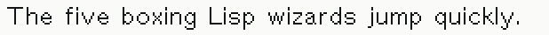

#### `HL12-AL-AR1` — `HL12`

**Logical selector:** `HELVETICA/ROMAN/12`

**Representation:** `Authored source · AL-AR1`

#### `HL12B`

**Logical selector:** `HELVETICA/BOLD/12`

**Representation:** `Authored source`

#### `HL12B-AL-AR1` — `HL12B`

**Logical selector:** `HELVETICA/BOLD/12`

**Representation:** `Authored source · AL-AR1`

#### `HL12I`

**Logical selector:** `HELVETICA/ITALIC/12`

**Representation:** `Authored source`

#### `HL12I-AL-AR1` — `HL12I`

**Logical selector:** `HELVETICA/ITALIC/12`

**Representation:** `Authored source · AL-AR1`

#### `HL14`

**Logical selector:** `HELVETICA/ROMAN/14`

**Representation:** `Authored source`

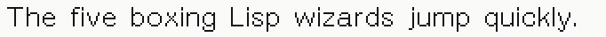

#### `HL14-AL-AR1` — `HL14`

**Logical selector:** `HELVETICA/ROMAN/14`

**Representation:** `Authored source · AL-AR1`

#### `HL18`

**Logical selector:** `HELVETICA/ROMAN/18`

**Representation:** `Authored source`

#### `HL18-AL-AR1` — `HL18`

**Logical selector:** `HELVETICA/ROMAN/18`

**Representation:** `Authored source · AL-AR1`

#### `HL6`

**Logical selector:** `HELVETICA/ROMAN/6`

**Representation:** `Authored source`

#### `HL6-AL-AR1` — `HL6`

**Logical selector:** `HELVETICA/ROMAN/6`

**Representation:** `Authored source · AL-AR1`

#### `HL7`

**Logical selector:** `HELVETICA/ROMAN/7`

**Representation:** `Authored source`

#### `HL7-AL-AR1` — `HL7`

**Logical selector:** `HELVETICA/ROMAN/7`

**Representation:** `Authored source · AL-AR1`

#### `HL7B`

**Logical selector:** `HELVETICA/BOLD/7`

**Representation:** `Authored source`

#### `HL7B-AL-AR1` — `HL7B`

**Logical selector:** `HELVETICA/BOLD/7`

**Representation:** `Authored source · AL-AR1`

#### `HL7BI`

**Logical selector:** `HELVETICA/BOLD-ITALIC/7`

**Representation:** `Authored source`

#### `HL7BI-AL-AR1` — `HL7BI`

**Logical selector:** `HELVETICA/BOLD-ITALIC/7`

**Representation:** `Authored source · AL-AR1`

#### `HL7I`

**Logical selector:** `HELVETICA/ITALIC/7`

**Representation:** `Authored source`

#### `HL7I-AL-AR1` — `HL7I`

**Logical selector:** `HELVETICA/ITALIC/7`

**Representation:** `Authored source · AL-AR1`

#### `HL8`

**Logical selector:** `HELVETICA/ROMAN/8`

**Representation:** `Authored source`

#### `HL8-AL-AR1` — `HL8`

**Logical selector:** `HELVETICA/ROMAN/8`

**Representation:** `Authored source · AL-AR1`

#### `HL8B`

**Logical selector:** `HELVETICA/BOLD/8`

**Representation:** `Authored source`

#### `HL8B-AL-AR1` — `HL8B`

**Logical selector:** `HELVETICA/BOLD/8`

**Representation:** `Authored source · AL-AR1`

#### `MEDFNT`

**Logical selector:** `MIT CADR Fixed (role-mapped)`

**Representation:** `Authored source`

#### `METS`

**Logical selector:** `METS/ROMAN/Default`

**Representation:** `Authored source`

#### `METSI`

**Logical selector:** `METS/ITALIC/Default`

**Representation:** `Authored source`

#### `NONM`

**Logical selector:** `NON/ROMAN/Medium`

**Representation:** `Authored source`

#### `NONS`

**Logical selector:** `NON/ROMAN/Small`

**Representation:** `Authored source`

#### `PRNT10`

**Logical selector:** `PRINT/ROMAN/10`

**Representation:** `Authored source`

#### `PRNT10-AL-AR1` — `PRNT10`

**Logical selector:** `PRINT/ROMAN/10`

**Representation:** `Authored source · AL-AR1`

#### `PRONTO`

**Logical selector:** `MIT CADR PRONTO (unmapped)`

**Representation:** `Authored source`

#### `PRT12B`

**Logical selector:** `PRINT/BOLD/12`

**Representation:** `Authored source`

#### `PRT12B-AL-AR1` — `PRT12B`

**Logical selector:** `PRINT/BOLD/12`

**Representation:** `Authored source · AL-AR1`

#### `SAIL10`

**Logical selector:** `SAIL/ROMAN/10`

**Representation:** `Authored source`

#### `SMT10`

**Logical selector:** `SMT/ROMAN/10`

**Representation:** `Authored source`

#### `SMT10-AL-AR1` — `SMT10`

**Logical selector:** `SMT/ROMAN/10`

**Representation:** `Authored source · AL-AR1`

#### `SMT10A`

**Logical selector:** `SMT/ALTERNATE-A/10`

**Representation:** `Authored source`

#### `SMT10A-AL-AR1` — `SMT10A`

**Logical selector:** `SMT/ALTERNATE-A/10`

**Representation:** `Authored source · AL-AR1`

#### `SMT14`

**Logical selector:** `SMT/ROMAN/14`

**Representation:** `Authored source`

#### `SMT14-AL-AR1` — `SMT14`

**Logical selector:** `SMT/ROMAN/14`

**Representation:** `Authored source · AL-AR1`

#### `SMT14A`

**Logical selector:** `SMT/ALTERNATE-A/14`

**Representation:** `Authored source`

#### `SMT14A-AL-AR1` — `SMT14A`

**Logical selector:** `SMT/ALTERNATE-A/14`

**Representation:** `Authored source · AL-AR1`

#### `ST10`

**Logical selector:** `ST/ROMAN/10`

**Representation:** `Authored source`

#### `ST10-AL-AR1` — `ST10`

**Logical selector:** `ST/ROMAN/10`

**Representation:** `Authored source · AL-AR1`

#### `ST6`

**Logical selector:** `ST/ROMAN/6`

**Representation:** `Authored source`

#### `ST6-AL-AR1` — `ST6`

**Logical selector:** `ST/ROMAN/6`

**Representation:** `Authored source · AL-AR1`

#### `ST8`

**Logical selector:** `ST/ROMAN/8`

**Representation:** `Authored source`

#### `ST8-AL-AR1` — `ST8`

**Logical selector:** `ST/ROMAN/8`

**Representation:** `Authored source · AL-AR1`

#### `TNTO14`

**Logical selector:** `TONTO/ROMAN/14`

**Representation:** `Authored source`

#### `TNTO14-AL-AR1` — `TNTO14`

**Logical selector:** `TONTO/ROMAN/14`

**Representation:** `Authored source · AL-AR1`

#### `TNTOB`

**Logical selector:** `TONTO/BOLD/Default`

**Representation:** `Authored source`

#### `TNTOB-AL-AR1` — `TNTOB`

**Logical selector:** `TONTO/BOLD/Default`

**Representation:** `Authored source · AL-AR1`

#### `TONTO`

**Logical selector:** `TONTO/ROMAN/Default`

**Representation:** `Authored source`

#### `TONTO-AL-AR1` — `TONTO`

**Logical selector:** `TONTO/ROMAN/Default`

**Representation:** `Authored source · AL-AR1`

#### `TR10`

**Logical selector:** `TIMES-ROMAN/ROMAN/10`

**Representation:** `Authored source`

#### `TR10-AL-AR1` — `TR10`

**Logical selector:** `TIMES-ROMAN/ROMAN/10`

**Representation:** `Authored source · AL-AR1`

#### `TR10B`

**Logical selector:** `TIMES-ROMAN/BOLD/10`

**Representation:** `Authored source`

#### `TR10B-AL-AR1` — `TR10B`

**Logical selector:** `TIMES-ROMAN/BOLD/10`

**Representation:** `Authored source · AL-AR1`

#### `TR10I`

**Logical selector:** `TIMES-ROMAN/ITALIC/10`

**Representation:** `Authored source`

#### `TR10I-AL-AR1` — `TR10I`

**Logical selector:** `TIMES-ROMAN/ITALIC/10`

**Representation:** `Authored source · AL-AR1`

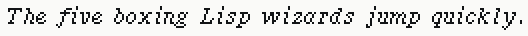

#### `TR12`

**Logical selector:** `TIMES-ROMAN/ROMAN/12`

**Representation:** `Authored source`

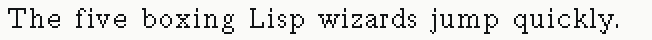

#### `TR12-AL-AR1` — `TR12`

**Logical selector:** `TIMES-ROMAN/ROMAN/12`

**Representation:** `Authored source · AL-AR1`

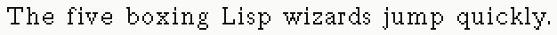

#### `TR12B`

**Logical selector:** `TIMES-ROMAN/BOLD/12`

**Representation:** `Authored source`

#### `TR12B-AL-AR1` — `TR12B`

**Logical selector:** `TIMES-ROMAN/BOLD/12`

**Representation:** `Authored source · AL-AR1`

#### `TR12I`

**Logical selector:** `TIMES-ROMAN/ITALIC/12`

**Representation:** `Authored source`

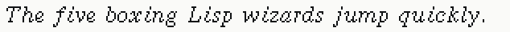

#### `TR12I-AL-AR1` — `TR12I`

**Logical selector:** `TIMES-ROMAN/ITALIC/12`

**Representation:** `Authored source · AL-AR1`

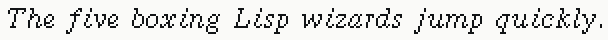

#### `TR14`

**Logical selector:** `TIMES-ROMAN/ROMAN/14`

**Representation:** `Authored source`

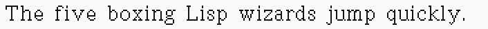

#### `TR14-AL-AR1` — `TR14`

**Logical selector:** `TIMES-ROMAN/ROMAN/14`

**Representation:** `Authored source · AL-AR1`

#### `TR18`

**Logical selector:** `TIMES-ROMAN/ROMAN/18`

**Representation:** `Authored source`

#### `TR18-AL-AR1` — `TR18`

**Logical selector:** `TIMES-ROMAN/ROMAN/18`

**Representation:** `Authored source · AL-AR1`

#### `TR8`

**Logical selector:** `TIMES-ROMAN/ROMAN/8`

**Representation:** `Authored source`

#### `TR8-AL-AR1` — `TR8`

**Logical selector:** `TIMES-ROMAN/ROMAN/8`

**Representation:** `Authored source · AL-AR1`

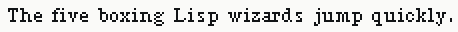

#### `TR8B`

**Logical selector:** `TIMES-ROMAN/BOLD/8`

**Representation:** `Authored source`

#### `TR8B-AL-AR1` — `TR8B`

**Logical selector:** `TIMES-ROMAN/BOLD/8`

**Representation:** `Authored source · AL-AR1`

#### `TR8I`

**Logical selector:** `TIMES-ROMAN/ITALIC/8`

**Representation:** `Authored source`

#### `TR8I-AL-AR1` — `TR8I`

**Logical selector:** `TIMES-ROMAN/ITALIC/8`

**Representation:** `Authored source · AL-AR1`

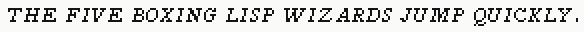

#### `TVFONT`

**Logical selector:** `MIT CADR Fixed (role-mapped)`

**Representation:** `Authored source`

### System 46 runtime profile (42)

#### `13FGB`

**Logical selector:** `FIXED-GOTHIC/BOLD/13`

**Representation:** `System 46 Runtime · source-backed current object`

#### `16FG`

**Logical selector:** `FIXED-GOTHIC/ROMAN/16`

**Representation:** `System 46 Runtime · source-backed current object`

#### `20VR`

**Logical selector:** `VR/ROMAN/20`

**Representation:** `System 46 Runtime · compiled-only current object`

#### `25FR3`

**Logical selector:** `FR3/ROMAN/25`

**Representation:** `System 46 Runtime · source-backed current object`

#### `31VR`

**Logical selector:** `VR/ROMAN/31`

**Representation:** `System 46 Runtime · compiled-only current object`

#### `40VR`

**Logical selector:** `VR/ROMAN/40`

**Representation:** `System 46 Runtime · compiled-only current object`

#### `40VSHD`

**Logical selector:** `VR/SHADOW/40 [STANDARD] · MIT CADR VR Shadow (role-mapped)`

**Representation:** `System 46 Runtime · source-backed current object`

#### `43VXMS`

**Logical selector:** `XMS-43/ROMAN/43 [XMS] · MIT CADR 43VXMS (role-mapped)`

**Representation:** `System 46 Runtime · source-backed current object`

#### `5X5`

**Logical selector:** `FIX/UPPERCASE/5`

**Representation:** `System 46 Runtime · source-backed current object`

#### `BIGFNT`

**Logical selector:** `MIT CADR Fixed (role-mapped)`

**Representation:** `System 46 Runtime · source-backed current object`

#### `BIGVG`

**Logical selector:** `MIT CADR BIGVG (unmapped)`

**Representation:** `System 46 Runtime · compiled-only current object`

#### `CPT-13FG`

**Logical selector:** `FIXED-GOTHIC/ROMAN/13`

**Representation:** `System 46 Runtime · compiled-only current object`

#### `CPT-CM10`

**Logical selector:** `COMPUTER-MODERN/ROMAN/10`

**Representation:** `System 46 Runtime · source-backed current object`

#### `CPT-CM12`

**Logical selector:** `COMPUTER-MODERN/ROMAN/12`

**Representation:** `System 46 Runtime · source-backed current object`

#### `CPT-HL10`

**Logical selector:** `HELVETICA/ROMAN/10`

**Representation:** `System 46 Runtime · compiled-only current object`

#### `CPT-HL10B`

**Logical selector:** `HELVETICA/BOLD/10`

**Representation:** `System 46 Runtime · compiled-only current object`

#### `CPT-TR10I`

**Logical selector:** `TIMES-ROMAN/ITALIC/10`

**Representation:** `System 46 Runtime · compiled-only current object`

#### `CPTFONT`

**Logical selector:** `MIT CADR Fixed (role-mapped)`

**Representation:** `System 46 Runtime · source-backed current object`

#### `GERM35`

**Logical selector:** `GERMAN-BLACKLETTER/ROMAN/35 [GERMAN] · MIT CADR German Blackletter (role-mapped)`

**Representation:** `System 46 Runtime · compiled-only current object`

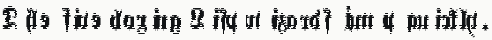

#### `HL10`

**Logical selector:** `HELVETICA/ROMAN/10`

**Representation:** `System 46 Runtime · source-backed current object`

#### `HL10B`

**Logical selector:** `HELVETICA/BOLD/10`

**Representation:** `System 46 Runtime · source-backed current object`

#### `HL12`

**Logical selector:** `HELVETICA/ROMAN/12`

**Representation:** `System 46 Runtime · source-backed current object`

#### `HL12B`

**Logical selector:** `HELVETICA/BOLD/12`

**Representation:** `System 46 Runtime · source-backed current object`

#### `HL12BI`

**Logical selector:** `HELVETICA/BOLD-ITALIC/12`

**Representation:** `System 46 Runtime · compiled-only current object`

#### `HL12I`

**Logical selector:** `HELVETICA/ITALIC/12`

**Representation:** `System 46 Runtime · source-backed current object`

#### `HL6`

**Logical selector:** `HELVETICA/ROMAN/6`

**Representation:** `System 46 Runtime · source-backed current object`

#### `HL7`

**Logical selector:** `HELVETICA/ROMAN/7`

**Representation:** `System 46 Runtime · source-backed current object`

#### `MEDFNB`

**Logical selector:** `MIT CADR Fixed (role-mapped)`

**Representation:** `System 46 Runtime · compiled-only current object`

#### `MEDFNT`

**Logical selector:** `MIT CADR Fixed (role-mapped)`

**Representation:** `System 46 Runtime · source-backed current object`

#### `METS`

**Logical selector:** `METS/ROMAN/Default`

**Representation:** `System 46 Runtime · source-backed current object`

#### `METSI`

**Logical selector:** `METS/ITALIC/Default`

**Representation:** `System 46 Runtime · source-backed current object`

#### `N43XMS` — `43VXMS`

**Logical selector:** `XMS-43/ROMAN/43 [XMS] · MIT CADR 43VXMS (role-mapped)`

**Representation:** `System 46 Legacy N43XMS · legacy compiled version`

#### `PRT12B`

**Logical selector:** `PRINT/BOLD/12`

**Representation:** `System 46 Runtime · source-backed current object`

#### `S35GER`

**Logical selector:** `GERMAN-BLACKLETTER/ROMAN/35 [GERMAN] · MIT CADR German Blackletter (role-mapped)`

**Representation:** `System 46 Runtime · compiled-only current object`

#### `SAIL12`

**Logical selector:** `SAIL/ROMAN/12`

**Representation:** `System 46 Runtime · compiled-only current object`

#### `TR10I`

**Logical selector:** `TIMES-ROMAN/ITALIC/10`

**Representation:** `System 46 Runtime · source-backed current object`

#### `TR12B`

**Logical selector:** `TIMES-ROMAN/BOLD/12`

**Representation:** `System 46 Runtime · source-backed current object`

#### `TR12B1`

**Logical selector:** `TIMES-ROMAN/ALTERNATE-1/12`

**Representation:** `System 46 Runtime · compiled-only current object`

#### `TR8`

**Logical selector:** `TIMES-ROMAN/ROMAN/8`

**Representation:** `System 46 Runtime · source-backed current object`

#### `TR8B`

**Logical selector:** `TIMES-ROMAN/BOLD/8`

**Representation:** `System 46 Runtime · source-backed current object`

#### `TR8I`

**Logical selector:** `TIMES-ROMAN/ITALIC/8`

**Representation:** `System 46 Runtime · source-backed current object`

#### `TVFONT`

**Logical selector:** `MIT CADR Fixed (role-mapped)`

**Representation:** `System 46 Runtime · source-backed current object`

## Symbols and drawing fonts (40)

### Authored source profile (33)

#### `APL14`

**Logical selector:** `APL/ROMAN/14 [APL] · MIT CADR APL (role-mapped)`

**Representation:** `Authored source`

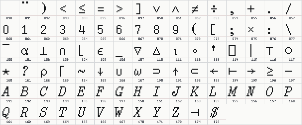

#### `APL14-AL-AR1` — `APL14`

**Logical selector:** `APL/ROMAN/14 [APL] · MIT CADR APL (role-mapped)`

**Representation:** `Authored source · AL-AR1`

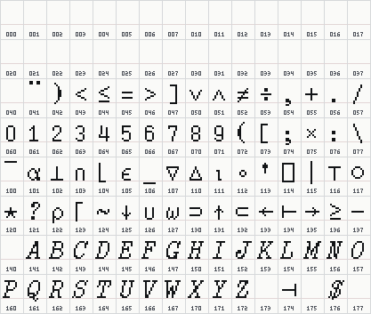

#### `ARR10`

**Logical selector:** `ARROWS/ROMAN/10 [ARROWS] · MIT CADR Arrows (role-mapped)`

**Representation:** `Authored source`

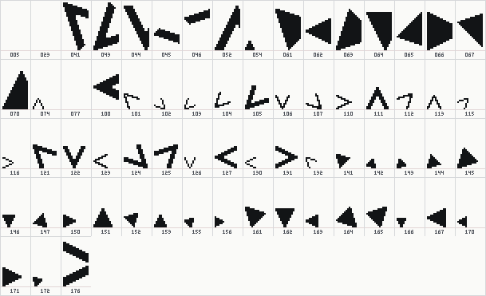

#### `ARR10-AL-AR1` — `ARR10`

**Logical selector:** `ARROWS/ROMAN/10 [ARROWS] · MIT CADR Arrows (role-mapped)`

**Representation:** `Authored source · AL-AR1`

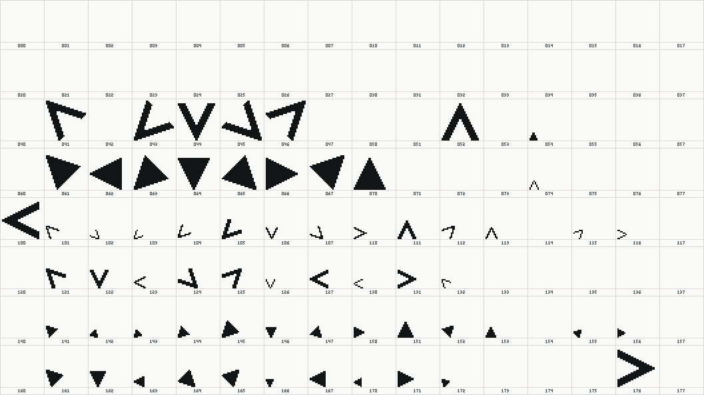

#### `ARROW`

**Logical selector:** `ARROWS/ROMAN/Default [ARROWS] · MIT CADR Arrows (role-mapped)`

**Representation:** `Authored source`

#### `ARROW-KST` — `ARROW`

**Logical selector:** `ARROWS/ROMAN/Default [ARROWS] · MIT CADR Arrows (role-mapped)`

**Representation:** `Authored source · KST`

#### `BUG`

**Logical selector:** `BUG/ROMAN/Default [BUG] · MIT CADR Bug (role-mapped)`

**Representation:** `Authored source`

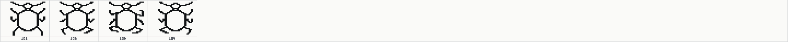

#### `BUG-KST` — `BUG`

**Logical selector:** `BUG/ROMAN/Default [BUG] · MIT CADR Bug (role-mapped)`

**Representation:** `Authored source · KST`

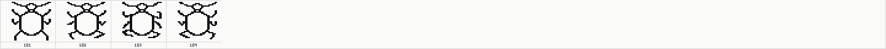

#### `CLARGK`

**Logical selector:** `CLAR/ROMAN/Greek [GREEK] · MIT CADR Clarendon Greek (role-mapped)`

**Representation:** `Authored source`

#### `CLARGK-AL-AR1` — `CLARGK`

**Logical selector:** `CLAR/ROMAN/Greek [GREEK] · MIT CADR Clarendon Greek (role-mapped)`

**Representation:** `Authored source · AL-AR1`

#### `CYR12`

**Logical selector:** `CYRILLIC/ROMAN/12 [CYRILLIC] · MIT CADR Cyrillic (role-mapped)`

**Representation:** `Authored source`

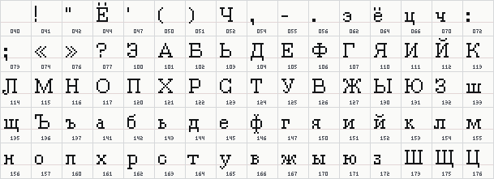

#### `CYR12-AL-AR1` — `CYR12`

**Logical selector:** `CYRILLIC/ROMAN/12 [CYRILLIC] · MIT CADR Cyrillic (role-mapped)`

**Representation:** `Authored source · AL-AR1`

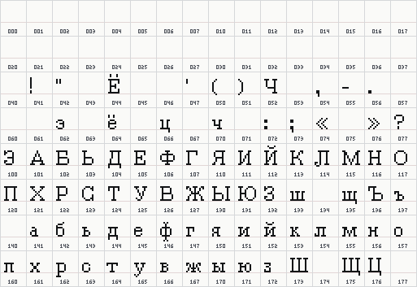

#### `GATES3`

**Logical selector:** `GATES/ROMAN/32 [GATES] · MIT CADR Gates (role-mapped)`

**Representation:** `Authored source`

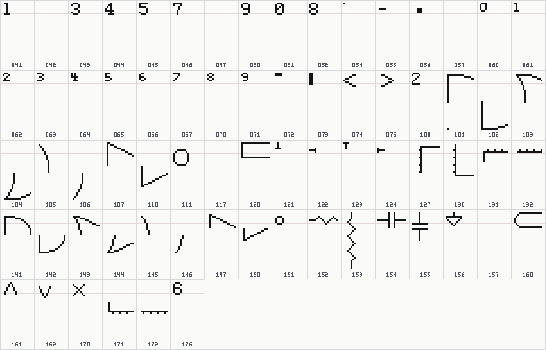

#### `GATES3-AL-AR1` — `GATES3`

**Logical selector:** `GATES/ROMAN/32 [GATES] · MIT CADR Gates (role-mapped)`

**Representation:** `Authored source · AL-AR1`

#### `GATS3A`

**Logical selector:** `GATES/ALTERNATE-A/32 [GATES] · MIT CADR Gates (role-mapped)`

**Representation:** `Authored source`

#### `GATS3A-AL-AR1` — `GATS3A`

**Logical selector:** `GATES/ALTERNATE-A/32 [GATES] · MIT CADR Gates (role-mapped)`

**Representation:** `Authored source · AL-AR1`

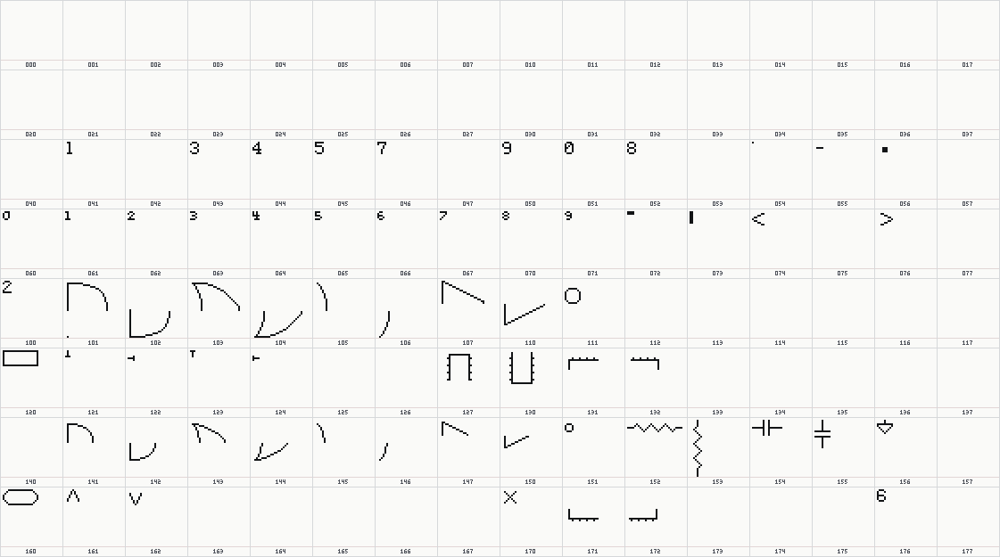

#### `HIP10A`

**Logical selector:** `HIPPO/ALTERNATE-A/10 [GREEK] · MIT CADR Hippo (role-mapped)`

**Representation:** `Authored source`

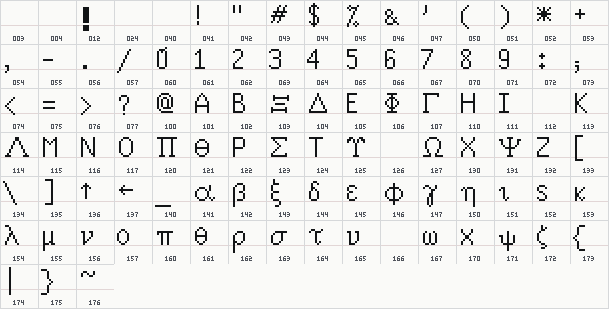

#### `HIP10A-AL-AR1` — `HIP10A`

**Logical selector:** `HIPPO/ALTERNATE-A/10 [GREEK] · MIT CADR Hippo (role-mapped)`

**Representation:** `Authored source · AL-AR1`

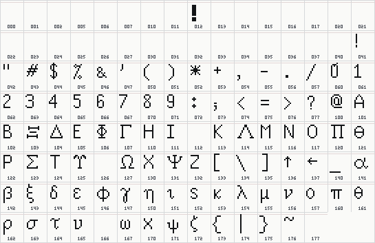

#### `HIPO10`

**Logical selector:** `HIPPO/ALTERNATE-O/10 [GREEK] · MIT CADR Hippo (role-mapped)`

**Representation:** `Authored source`

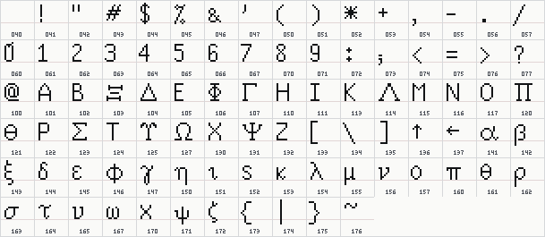

#### `HIPO10-AL-AR1` — `HIPO10`

**Logical selector:** `HIPPO/ALTERNATE-O/10 [GREEK] · MIT CADR Hippo (role-mapped)`

**Representation:** `Authored source · AL-AR1`

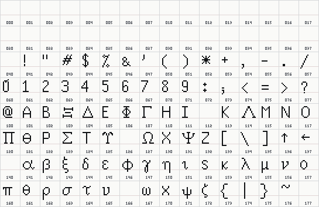

#### `MAT10A`

**Logical selector:** `MATH/ALTERNATE-A/10A Name [MATH] · MIT CADR Math (role-mapped)`

**Representation:** `Authored source`

#### `MAT10A-AL-AR1` — `MAT10A`

**Logical selector:** `MATH/ALTERNATE-A/10A Name [MATH] · MIT CADR Math (role-mapped)`

**Representation:** `Authored source · AL-AR1`

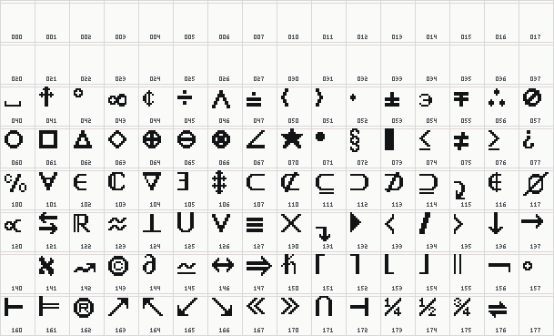

#### `MATH10`

**Logical selector:** `MATH/ROMAN/10 Name [MATH] · MIT CADR Math (role-mapped)`

**Representation:** `Authored source`

#### `MATH10-AL-AR1` — `MATH10`

**Logical selector:** `MATH/ROMAN/10 Name [MATH] · MIT CADR Math (role-mapped)`

**Representation:** `Authored source · AL-AR1`

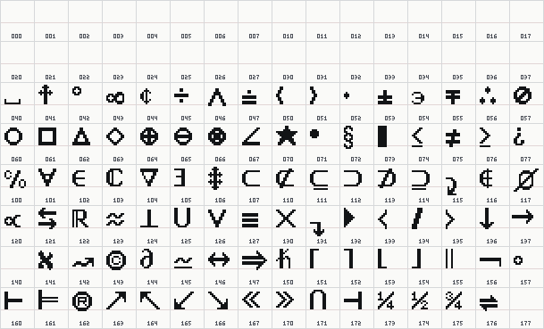

#### `MATH16`

**Logical selector:** `MATH/ROMAN/16 Name [MATH] · MIT CADR Math (role-mapped)`

**Representation:** `Authored source`

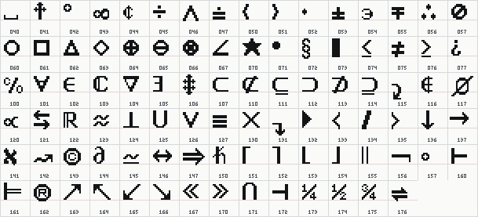

#### `MATH16-AL-AR1` — `MATH16`

**Logical selector:** `MATH/ROMAN/16 Name [MATH] · MIT CADR Math (role-mapped)`

**Representation:** `Authored source · AL-AR1`

#### `MOUSE`

**Logical selector:** `MOUSE/ROMAN/Default [MOUSE] · MIT CADR Mouse (role-mapped)`

**Representation:** `Authored source`

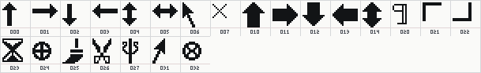

#### `MUSC10`

**Logical selector:** `MUSIC/ROMAN/10 [MUSIC] · MIT CADR Music (role-mapped)`

**Representation:** `Authored source`

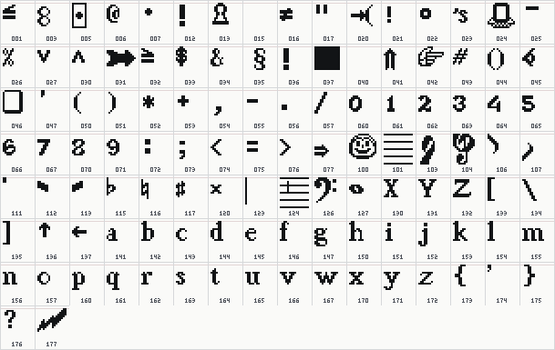

#### `MUSC10-AL-AR1` — `MUSC10`

**Logical selector:** `MUSIC/ROMAN/10 [MUSIC] · MIT CADR Music (role-mapped)`

**Representation:** `Authored source · AL-AR1`

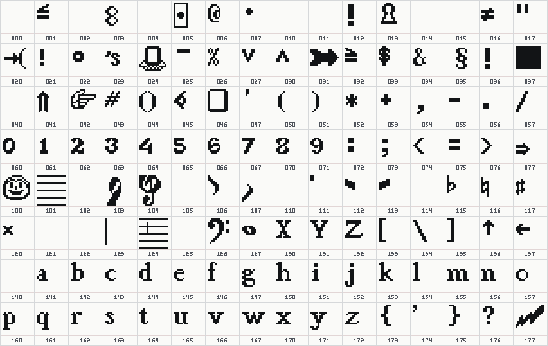

#### `PLNK16`

**Logical selector:** `PLANK/ROMAN/16 [PLANK] · MIT CADR Plank (role-mapped)`

**Representation:** `Authored source`

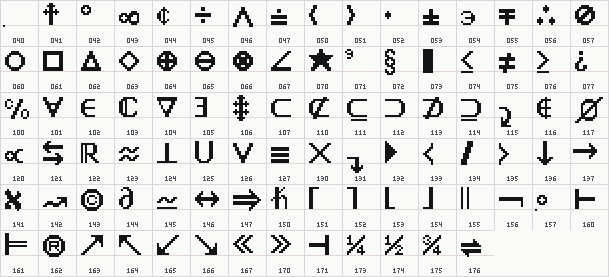

#### `PLNK16-AL-AR1` — `PLNK16`

**Logical selector:** `PLANK/ROMAN/16 [PLANK] · MIT CADR Plank (role-mapped)`

**Representation:** `Authored source · AL-AR1`

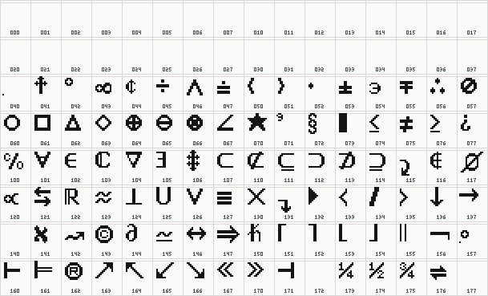

#### `SWFONT`

**Logical selector:** `SWFONT/ROMAN/Default [SWFONT] · MIT CADR SWFONT (role-mapped)`

**Representation:** `Authored source`

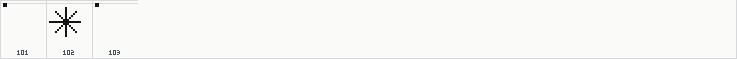

#### `TOG`

**Logical selector:** `TOG/ROMAN/Default [TOG] · MIT CADR TOG (role-mapped)`

**Representation:** `Authored source`

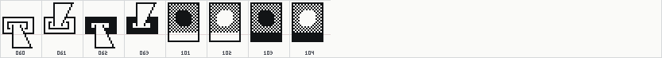

### System 46 runtime profile (7)

#### `ARROW`

**Logical selector:** `ARROWS/ROMAN/Default [ARROWS] · MIT CADR Arrows (role-mapped)`

**Representation:** `System 46 Runtime · source-backed current object`

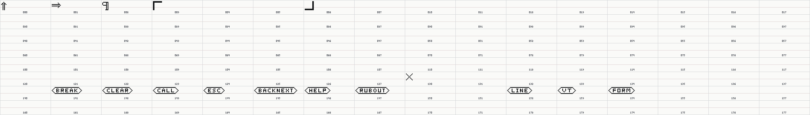

#### `MOUSE`

**Logical selector:** `MOUSE/ROMAN/Default [MOUSE] · MIT CADR Mouse (role-mapped)`

**Representation:** `System 46 Runtime · source-backed current object`

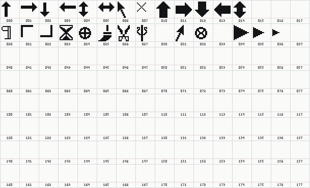

#### `NTOG` — `TOG`

**Logical selector:** `TOG/ROMAN/Default [TOG] · MIT CADR TOG (role-mapped)`

**Representation:** `System 46 Legacy NTOG · legacy compiled version`

#### `S30CHS`

**Logical selector:** `CHESS/ROMAN/30 [CHESS] · MIT CADR Chess (role-mapped)`

**Representation:** `System 46 Runtime · compiled-only current object`

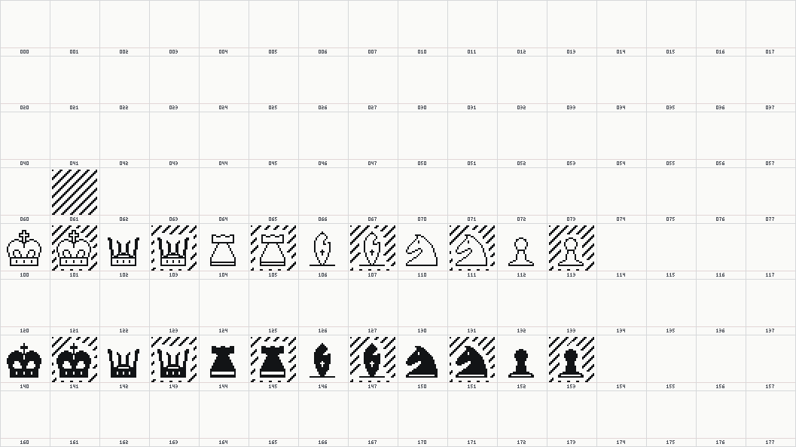

#### `SEARCH`

**Logical selector:** `SEARCH/ROMAN/Default [SEARCH] · MIT CADR Search (role-mapped)`

**Representation:** `System 46 Runtime · compiled-only current object`

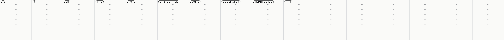

#### `SHIP`

**Logical selector:** `SHIP/ROMAN/Default [SHIP] · MIT CADR Ship (role-mapped)`

**Representation:** `System 46 Runtime · compiled-only current object`

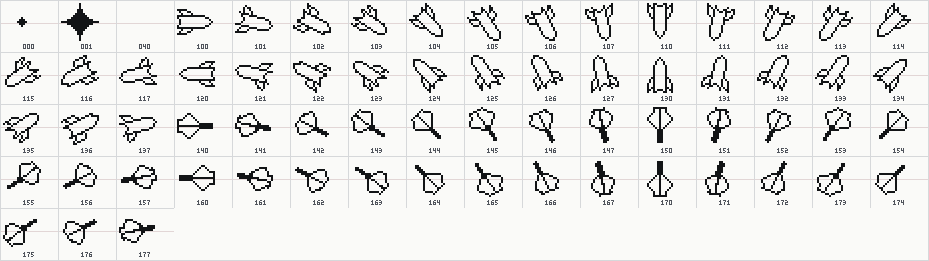

#### `TOG`

**Logical selector:** `TOG/ROMAN/Default [TOG] · MIT CADR TOG (role-mapped)`

**Representation:** `System 46 Runtime · source-backed current object`

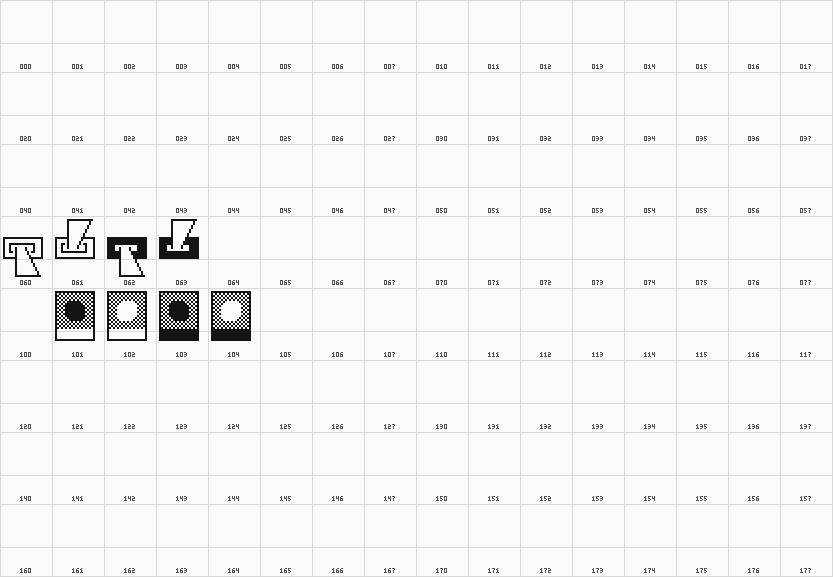
